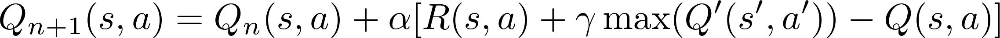
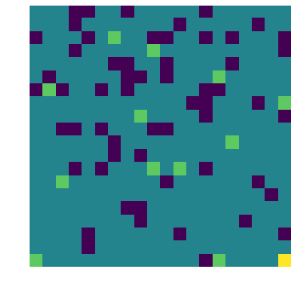
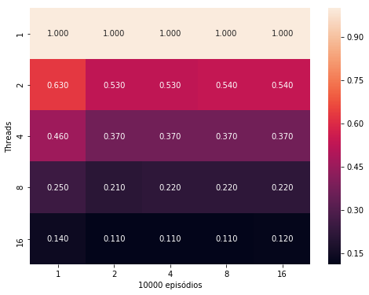

# Parallel Q-Learning with OpenMP

## Introduction

Q-Learning is a reinforcement learning algorithm used to solve sequential decision problems such as games, robotics and optimization. The basic idea is that of an agent interacting with the environment through actions and for each action in a given state, a certain reward or cost is provided. Thus, over several iterations, the agent is trained to achieve the desired goal.

These types of algorithm require training with a large number of episodes and therefore a large computational power is required. To solve this problem, this work proposes a parallelization of this algorithm.

## Basic Concepts

In reinforcement learning, first a set of rules, allowed actions and rewards for each action is defined, which will be the universe where the agents will belong, ie the **environment**. An **agent** who interacts with this environment will receive **rewards** for each **action** taken, depending on the current **state** in the environment.

Thus, the goal of reinforcement learning algorithms is to find a `π (s, a)` policy where `s` is the current state and` a` is the action to maximize the accumulation of rewards to the ultimate goal.

## The Q-Learning Algorithm

This work proposes a parallelization for a reinforcement learning algorithm known as Q-Learning, which consists in filling a table called Q-table with values related to reward when a certain action is taken from a certain state. These values are obtained from the agent's experience gained over several episodes.

The table is filled iteratively according to the following relationship:

Where `α` is the learning rate; `R (s, a)` is the reward gained when performing the `a` action in the` s` state; `γ` is a discount rate that reduces the reward considered in training for increasingly distant steps in the future; `max (Q '(s', a'))` is the value of Q for the highest rewarding action `a` in the` s` state and `Q (s, a)` is the current value of Q.

Thus, the Q value for the current state is calculated by taking into account the reward and Q values for future states according to each action taken.

## The Problem

The problem consists of a 20x20 square grid where an agent will start at position (0, 0) and aim to reach position (20, 20) and can take steps up, down, left and right, so that the agent walks through the possible states. Each state will have a reward value associated with it. The table below shows the values of the rewards.

| Action | Value |
|---|---|
|STEP|-2|
|FOOD|5|
|TRAP|-20|
|END|-100|

Each step (STEP) will have a certain cost, so the agent will learn to reach the final goal (END) as quickly as possible. There are traps (TRAP) and rewards (FOOD) scattered throughout the environment. Also, when the agent goes through a position where there is a reward or trap, the reward value in this position is updated to represent the agent's consumption.

A representation of the randomly generated environment can be seen in the image below.

## Implementation

### The environment

Initially the space is generated and the agent positioned at (0, 0). From there, the agent can perform up, down, right, or left steps with each iteration. Each state will determine the allowed steps, to prevent us from being stuck indefinitely in a step against the limits of the environment, for example. The episode ends when the agent falls into a trap or argues the ultimate goal.

### Parallelism

Parallelization was done in OpenMP to distribute episodes to each thread with a random start position for each episode. This way each thread will have its own Q-table and will eventually be reduced by summing the main Q-table.

## Training

Training is the part of implementation that is, in fact, parallel. Each thread will receive a number of episodes to simulate and will generate their own Q-tables for later shrink to one main.

Each episode consists of a reset of the agent position and reward table. Then, from each state is determined which step to take by selecting a step randomly or the step relative to the highest Q-table value according to a probability that reduces with each iteration. Thus, the agent is encouraged to explore the environment. At the end of the iteration, the Q-table will be updated.

An important aspect of training is that there is a minimum amount of iterations for Q-table to obtain values needed for the agent to be able to meet the end goal. The parallel implementation divides the number of these iterations across the threads, so each execution unit needs to simulate only a fraction of the iterations required for convergence.

## Results

### Agent

Once Q-table was obtained, a simulation of how the agent behaves in the environment was performed in order to verify that it was properly trained. The image below shows the agent's route.

### Runtime

The execution time for each number of episodes in each number of threads was measured. The values obtained are shown in the figure below.

### SpeedUp

SpeedUp was obtained from the ratio of runtime to `n` threads to time with only one therad, as shown in the figure below.

### Efficiency

Efficiency is obtained from the ratio of speedup to number of threads, as shown in the figure below.

## Conclusions

You can see that there is an improvement in runtime as the number of threads increases. However, the program is classified as **non-scalable** because it is unable to maintain efficiency with increasing problem size and number of threads.

Still, the program showed a faster convergence to this kind of problem when it is implemented in parallel.
