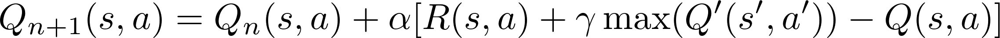
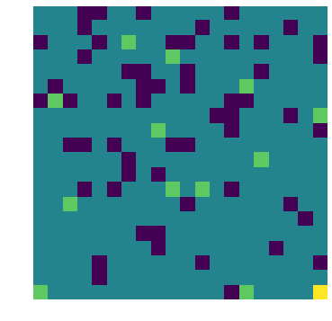
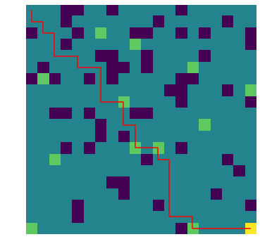
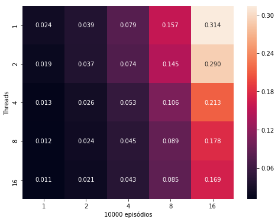
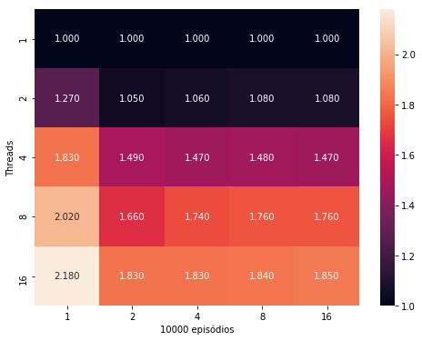
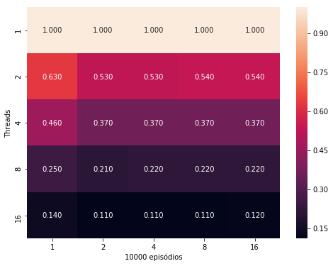

# Q-Learning Paralelo com OpenMP

## Introdução

Q-Learning é um algoritmo de aprendizagem por reforço usado para resolver problemas de decisão sequenciais como jogos, robótica e otimização. A ideia básica é a de um agente interagindo com o ambiente por meio de ações e para cada ação em um determinado estado, é fornecida uma determinada recompensa ou custo. Desta forma, ao decorrer de várias iterações, o agente é treinado para atingir o objetivo desejado.

Estes tipos de algoritmo requerem um treinamento com um grande número de episódios e, portanto, um grande poder computacional é necessário. Para resolver este problema, é proposto neste trabalho uma paralelização desde algoritmo.

## Conceitos Básicos

Em aprendizagem por reforço, primeiramente é definido um conjunto de regras, ações permitidas e recompensas por cada ação, que será o universo onde os agentes pertencerão. Ou seja, o **ambiente**. Um **agente** que interage com este ambiente receberá **recompensas** por cada **ação** realizada, dependendo do **estado** atual no ambiente.

Assim, o objetivo de algoritmos de aprendizado por reforço é encontrar uma política `π(s,a)` onde `s` é o estado atual e `a` é a ação maximizar o acúmulo de recompensas até o objetivo final.

## O Algoritmo Q-Learning

Neste trabalho é proposto uma forma de paralelização para um algoritmo de aprendizado por reforço conhecido por Q-Learning, que consiste em preencher uma tabela chamada Q-table com valores relacionados a recompensa quando uma determinada ação é tomada a partir de um determinado estado. Estes valores são obtidos a partir da experiência do agente adquirida no decorrer de vários episódios.

A tabela é preenchida iterativamente de acordo com a seguinte relação:

Onde `α` é a taxa de aprendizado; `R(s,a)` é a recompensa adquirida quando é realizada a ação `a` no estado `s`; `γ` é uma taxa de desconto que reduz a recompensa considerada no treinamento para passos cada vez mais distantes no futuro; `max(Q'(s',a'))` é o valor de Q para a ação `a` com maior recompensa no estado `s` e `Q(s,a)` é o valor atual de Q.

Desta forma, o valor de Q para o estado atual é calculado levando em conta a recompensa e valores de Q para estados futuros de acordo com cada ação tomada.

## O Problema

O problema consiste em uma grade quadrada 20x20 onde um agente começará na posição (0, 0) e terá como objetivo chegar na posição (20, 20) podendo dar passos para cima, baixo, esquerda e direita, de forma ao agente caminhar por todos os estados possíveis. Cada estado terá a ele associado um valor de recompensa. A tabela abaixo mostra os valores das recompensas.

| Ação | Valor |
|---|---|
|STEP|-2|
|FOOD|5|
|TRAP|-20|
|END|-100|

Cada passo(STEP) terá um determinado custo, desta forma o agente aprenderá a atingir o objetivo final(END) da forma mais rápida possível. Há armadilhas(TRAP) e recompensas(FOOD) espalhadas pelo ambiente. Além disso, quando o agente passa por uma posição onde haja uma recompensas ou armadilha, o valor da recompensa nesta posição é atualizado para representar o consumo do agente.

Uma representação do ambiente gerado aleatoriamente pode ser vista na imagem abaixo.

## Implementação

### O Ambiente

Inicialmente o espaço é gerado e o agente posicionado em (0, 0). A partir daí, o agente poderá realizar passos para cima, baixo, direita ou esquerda a cada iteração. Cada estado determinará os passos permitidos, para evitar de o a gente ficar preso indefinidamente em um passo contra os limites do ambiente, por exemplo. O episódio termina quando o agente cai em uma armadilha ou aringe o objetivo final.

### Paralelismo

A paralelização foi feita em OpenMP de forma a distribuir os episódios a cada thread com uma posição inicial aleatória para cada episódio. Desta forma, cada thread possuirá sua própria Q-table e, ao final, serão reduzidas por meio de soma à Q-table principal. 

## Treinamento

O treinamento é a parte da implementação que é, de fato, paralela. Cada thread receberá uma quantidade de episódios para simular e gerarão suas próprias Q-tables para mais tarde serem reduzidas em uma principal.

Cada episódio consiste em um reset da posição do agente e tabela de recompensa. Então, a partir de cada estado é determinado qual passo tomar selecionando um passo aleatoriamente ou o passo referente ao valor mais alto da Q-table de acordo com uma probabilidade que reduz a cada iteração. Assim, o agente é encorajado a explorar o ambiente. Ao final da iteração, será atualizada a Q-table.

Um aspecto importante do treinamento é que existe uma quantidade mínima de iterações para a Q-table obter valores necessários para o agente ser capaz de cumprir o objetivo final. A implementação paralela divide o número dessas iterações pelas threads, fazendo com que cada unidade de execução precise simular somente uma fração das iterações necessárias para convergência.

## Resultados

### Agente

Uma vez obtida a Q-table, foi realizada uma simulação de como o agente se comporta no ambiente com o propósito de verificar se este foi devidamente treinado. A imagem abaixo mostra o percurso do agente.

### Tempo de Execução

Foi medido o tempo de execução para cada número de episódios em cada número de threads. Os valores obtidos são mostrados na figura abaixo.

### SpeedUp

O SpeedUp foi obtido a partir da razão entre o tempo de execução para `n` threads pelo tempo com apenas uma therad, como mostrado na figura abaixo.

### Eficiência

A eficiência é obtida a partir da razão entre o speedup pelo número de threads, como mostrado na figura abaixo.

## Conclusões

É possível perceber que há uma melhora no tempo de execução a medida que aumenta-se o número de threads. Porém, o programa se classifica como **não escalável** pois não é capaz de manter a eficiência com o aumento do tamanho do problema e do número de threads.

Ainda assim, o programa mostrou uma convergência mais rápida para este tipo de problema quando este é implementado de forma paralela.